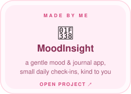
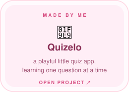
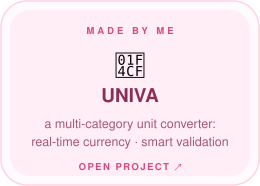
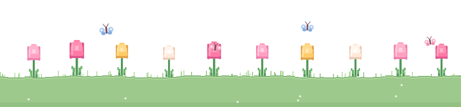

<!-- ---- intro card (animated) ---- -->
  
 <!-- ---- header ---- --><h2 align="center">hello, I'm <b>Nishi Deo Koshta</b> ✿</h2> 
<b>nishi-0711</b>

<i>BTech AI/ML student who loves building and learning new technologies</i>
<!-- ---- animated typing line ---- -->
  
 <!-- ---- favourite tools ---- -->
       
 

<!-- ======================== ABOUT ME ======================== --><h3 align="center">About me</h3>
 Hi, I'm <b>Nishi Deo Koshta</b>. I like making small things feel <i>just right</i> , software that's simple, kind to the people using it, and a little delightful. i care about the details other people skim past. 

 🌱 <b>currently</b> learning <b>golang</b> &amp; design systems &nbsp;·&nbsp; 🕊️ <b>open source</b>; ☕ <b>powered by</b> coffee &amp; good questions 
 

<!-- ======================== MADE BY ME ========================  --><h3 align="center">Made by me</h3> 
<i>A few small things I've built &amp; tinkered with</i>

    
 

<!-- ======================== SAY HI ======================== --><h3 align="center">say hi</h3> 
 <a href="mailto:hello@example.com">email</a> · <a href="https://your-site.dev">website</a> · <a href="https://www.linkedin.com/in/your-handle">linkedin</a> · <a href="https://github.com/your-username">github</a> 
 <!-- ==================== A LINE OF TULIPS (bottom) ==================== No sky, no box — transparent above. A single line of grass with little blades poking out, plump tulips (pink/yellow/cream) growing out of it, and tiny butterflies. A few tulips sway gently. Re-skin in gen_assets.py. -->
  

<i>dream it · build it · keep it pink ✿</i>

